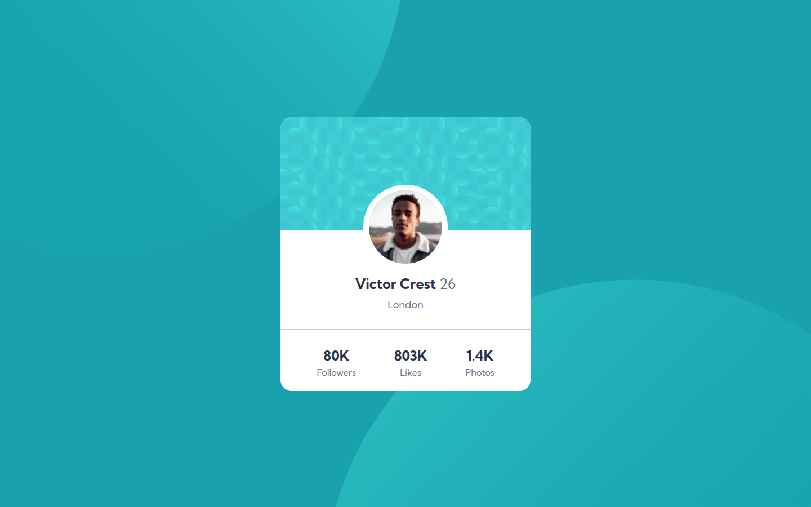

# Frontend Mentor - Profile card component solution

This is a solution to the [Profile card component challenge on Frontend Mentor](https://www.frontendmentor.io/challenges/profile-card-component-cfArpWshJ). Frontend Mentor challenges help you improve your coding skills by building realistic projects. 

## Table of contents

- [Overview](#overview)
  - [Screenshot](#screenshot)
  - [Links](#links)
- [My process](#my-process)
  - [Built with](#built-with)
  - [What I learned](#what-i-learned)
- [Author](#author)

## Overview

### Screenshot

Desktop View

Mobile View

### Links

- Solution URL: [Solution URL here](https://github.com/abdullah09c/profile-card-component-main.git)
- Live Site URL: [Live Site URL here](https://abdullah09c.github.io/profile-card-component-main/)

## My process

### Built with

- Semantic HTML5 markup
- CSS custom properties
- Flexbox

### What I learned

Through this project, I gained valuable experience with CSS positioning and layering techniques. Specifically, I learned how to:

- Create and position background shapes using CSS pseudo-elements and absolute positioning
- Effectively use the `z-index` property to control the stacking order of elements
- Implement complex background designs that enhance the visual appeal without interfering with content readability
- Better understand how the `position` property (`relative`, `absolute`, `fixed`) affects element placement and creates new stacking contexts

These techniques allowed me to achieve the desired visual design while maintaining clean, semantic HTML structure.

## Author

- Frontend Mentor - [@abdullah09c](https://www.frontendmentor.io/profile/abdullah09c)
- GitHub - [@abdullah09c](https://github.com/abdullah09c)